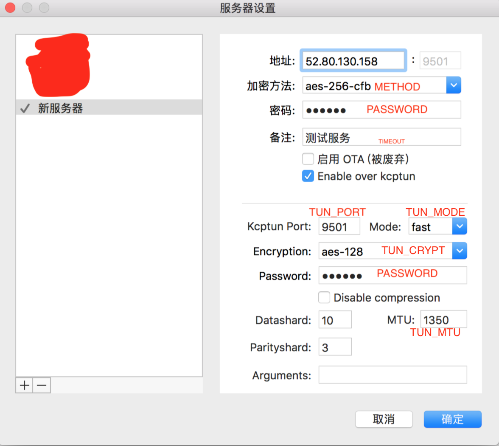

[](https://travis-ci.org/jinfeijie/canCross)     [](https://hub.docker.com/r/mrjin/shadowsocks/)    [](https://github.com/jinfeijie/Docker)     [](https://github.com/jinfeijie/Docker)


## 可修改变量
| 环境变量       | 默认值         | 建议         |
| ------------- |:-------------:|:-----------:|
| PASSWORD      | jin123        | 可修改       |
| METHOD        | aes-256-cfb   | 可修改       |
| TIMEOUT       | 300           | 不建议修改    |  
| DNS_ADDR      | 8.8.8.8       | 不建议修改    | 
| DNS_ADDR_2    | 8.8.4.4       | 不建议修改    | 
| TUN_PORT      | 443           | 可修改       |
| TUN_CRYPT     | aes-128       | 可修改       |
| TUN_MODE      | fast          | 可修改       |
| TUN_MTU       | 1350          | 不建议修改    | 
| TUN_DATASHARD | 10            | 不建议修改    | 
| TUN_PS        | 3             | 不建议修改    | 




## 获取本镜像

🚘获取本镜像：`docker pull mrjin/shadowsocks:alpine`

## docker-compose 部署
```
version: '2.0'
services:
  strcpy-fly:
    image: mrjin/shadowsocks:alpine
    container_name: strcpy-fly
    restart: always
    environment:
      - PASSWORD=123456 
      - TUN_PORT=15000
    ports:
      - "15000:15000/udp"
```


## 其他
📧联系[@jinfeijie](mailto:me@jinfeijie.cn)

✨欢迎 Star && Fork
